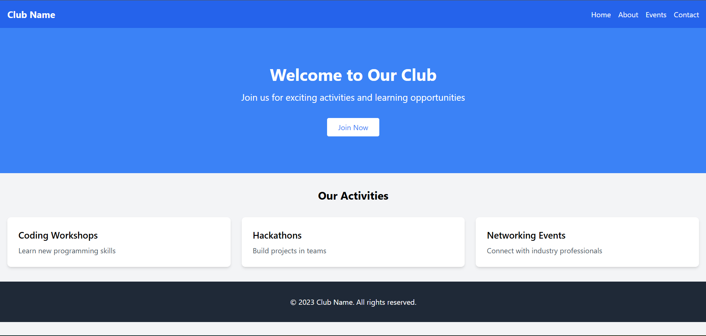

# Club Landing Page

## Project Idea
A simple landing page for a university club, showcasing activities and encouraging membership.

## Project Structure
```
club-landing-page/
├── club-landing-page/  # Main project folder
│   ├── src/
│   │   ├── components/
│   │   │   ├── Navbar.tsx
│   │   │   ├── Hero.tsx
│   │   │   ├── Card.tsx
│   │   │   └── Footer.tsx
│   │   ├── App.tsx
│   │   ├── main.tsx
│   │   └── index.css
│   ├── package.json
│   ├── tailwind.config.js
│   ├── postcss.config.js
│   └── ...
└── README.md
```

## Components Used
- **Navbar**: Navigation bar with club name and menu links
- **Hero**: Hero section with welcome message and call-to-action button
- **Card**: Reusable card component for displaying activities (used 3 times)
- **Footer**: Footer with copyright information

## How to Run
1. Navigate to the `club-landing-page` folder
2. Run `npm install` to install dependencies
3. Run `npm run dev` to start the development server
4. Open the browser to the provided localhost URL

## Technologies Used
- React with TypeScript
- Tailwind CSS for styling
- Vite for build tool

